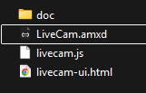
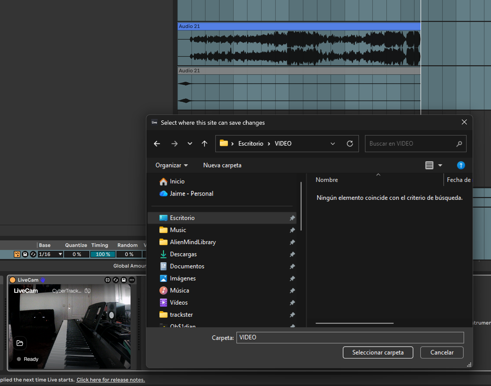
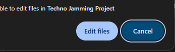
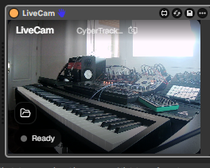
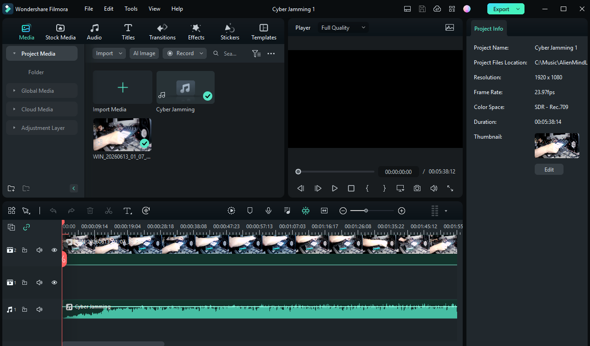

# LiveCam — Max for Live Camera Sync

Records webcam video in sync with an Ableton Live recording session. Drop it on any armed track; when that track starts recording, LiveCam captures from your camera and writes a timestamped video file.

## Features

- Works on **any track** (audio or MIDI). As a Max MIDI Effect it never touches your signal.
- **Automatic**: recording starts and stops with the transport. Arm the track, hit record, walk away.
- **In-device camera preview** to see what the camera sees without opening another app.
- **Switch cameras** with one click to cycle through all connected devices.
- **Choose your output folder once**. The choice is remembered across sessions.
- **Portable**: unzip anywhere. No install, no config.

## Installation

1. Download the latest `livecam-dist.zip` from [Releases](https://github.com/alienmind/livecam-m4l/releases).
2. Unzip it. Keep the three files together:
   ```
   LiveCam/
   ├── ableton-template.amxd
   ├── wrapper.js
   └── livecam-ui.html
   ```
3. In Ableton, open the browser (**B**) and navigate to the unzipped folder.
4. Drag **ableton-template.amxd** onto any track.



## Using it

1. **Arm** the track (Arm button in Ableton).
2. Click the **folder icon** (bottom-left of the device panel) to pick where files are saved. You only need to do this once.



   The browser will ask for permission to edit files in the selected folder first time you instantiate this device - click **Edit files** to allow it.



3. **On first use**, your browser may ask for permission to access your webcam — **accept this request** to enable video capture.
4. Press **global Record** + **Play** in the Ableton transport.
   LiveCam starts recording automatically when the track is armed and recording.
5. Stop the transport. The `.webm` file is written immediately.
6. **Export your audio track** from Ableton (File → Export Audio) to sync with the video.

### Putting it together

You now have two files:
- **livecam_*.webm** — your video file (from LiveCam)
- **your-track.wav/mp3** — your audio file (exported from Ableton)

Drag both files into any video editing tool (DaVinci Resolve, Premiere Pro, CapCut, etc.) and sync them by timeline. Most modern editors support WebM natively.

### Controls at a glance

| Element | Where | What it does |
|---|---|---|
| Camera preview | Fills the panel | Live feed from the active camera |
| Folder icon | Bottom-left | Choose / change output folder |
| Camera name | Top-right | Shows the active device name |
| Arrow icon (next to name) | Top-right | Switch to next camera |
| Red ring | Panel border | Visible while recording |
| Status pill | Bottom | Ready / REC / Saved … / error |



Double-click the **LiveCam** title (top-left) to open the About screen.

## Output

Files are saved as **WebM** (VP8/VP9) using your browser's `MediaRecorder`. Filename format:

```
livecam_20240101_120000.webm
```

Import this file and your exported audio into your video editor. WebM is widely supported in modern editing tools.

### Advanced: Convert to MP4

If your video editor doesn't support WebM, convert it using FFmpeg:

```bash
ffmpeg -i livecam_20240101_120000.webm -c copy output.mp4
```

Then import the MP4 and audio file into your editor.



## Notes

- **Video only**: This plugin records video from your webcam only. Audio must be exported separately from Ableton and combined in your video editor.
- **Output folder**: Cannot be auto-set to Ableton's project folder due to browser sandbox limitations. Pick a folder once and it's remembered via IndexedDB.
- **Webcam is single-consumer**: While editing the Max patch, two instances of the device compete for the camera. The live track device wins; the editor shows "could not start video source". That's expected.
- **WebM only**: The format that `MediaRecorder` produces natively.

## Requirements

- Ableton Live **Suite** 12.4+ (includes Max for Live / Max 9)

## Get the plugin

LiveCam is available on Gumroad: [alienmindzzz.gumroad.com/l/livecam](https://alienmindzzz.gumroad.com/l/livecam)

The source code is free and open-source under MIT. If you'd like to support development, consider buying it on Gumroad—think of it as buying me a coffee! ☕

## Creating (or Recreating) `ableton-template.amxd`

The `.amxd` file is a Max for Live wrapper patcher. If you need to recreate it from scratch:
1. In Ableton Live, drag a default **Max MIDI Effect** onto any track.
2. Click the device's **Edit** button (looks like a plug/slider or check device menu) to open Max.
3. In the Max editor, delete all default/placeholder objects.
4. Press `n` to create a new object box and type:
   - `live.thisdevice`
   - `js wrapper.js`
   - `jweb @enablejavascript 1`
5. Connect them:
   - Connect the outlet of `live.thisdevice` to the inlet of `js wrapper.js`.
   - Connect the first outlet of `js wrapper.js` to the inlet of `jweb`.
6. Open the `jweb` Inspector, locate the **Initial URL** attribute, and set it to `about:blank`.
7. Right-click the `jweb` object and select **Add to Presentation**.
8. Go to Presentation mode and resize the `jweb` frame to fill the device panel (typically 320x180 px).
9. Save the device as `ableton-template.amxd` in the `ableton-amxd/` folder.

## License

MIT — see [LICENSE](./LICENSE) for details.

---

More info: [livecam.alienmind.io](https://livecam.alienmind.io)
